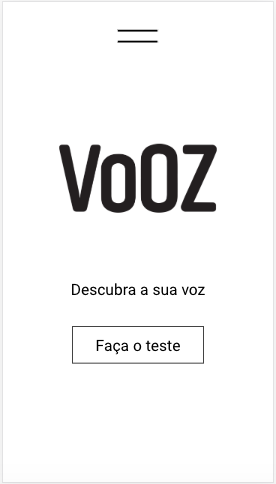
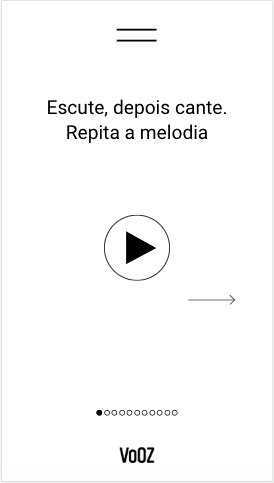
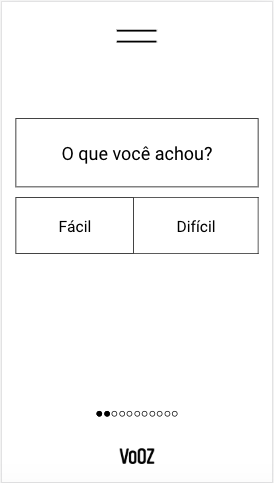
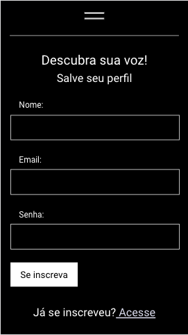
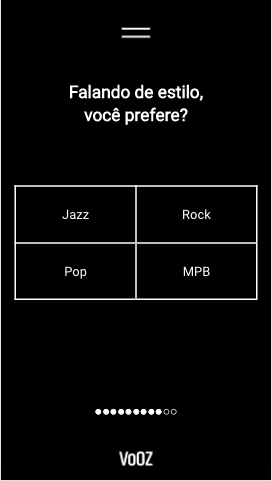
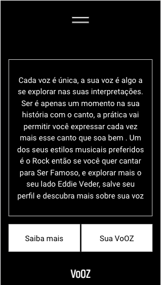

# VoOZ QUIZ

## App to help VoOZ company delivering custom online courses for their singing students.

   
  
  

## This Repository

TWO FOLDERS.

* Backend | API built with NodeJs
* vooz-ap | App built with React library.

## Link

https://vooz-quiz.herokuapp.com  - for App and API on the same server.

OR

https://confident-mcclintock-11c16a.netlify.com - for Serverless App.

## Development

MERN stack

## For more info check inside each specific folder.

## Contributing
Pull requests are welcome. For major changes, please open an issue first to discuss what you would like to change.

